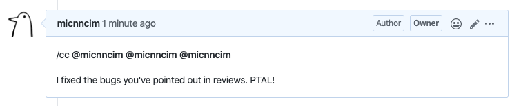
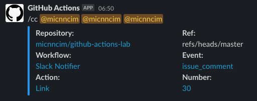

# Action Slack Notifier

[![actions-workflow-test][actions-workflow-test-badge]][actions-workflow-test]
[![release][release-badge]][release]
[![license][license-badge]][license]


This is a GitHub Action to send notifications to Slack on general purpose.

This action is designed to focus on sending notifications, so you can flexibly customize your workflow with this action.
For example, sending a message to you when a job status changes, you get a comment in an issue, a label is added to your pull request, and so on.

It would be more useful to use this with other GitHub Actions' outputs.

## Prerequisites

Before getting started, let's create a Slack app!

This action requires the permission `chat:write` or optionally `chat:write.customize`.
If you want to change the icon for a message, choose `chat:write.customize`.

If you're not familiar with creating a Slack app, see the guide below.

<details>
<summary>Slack App Setup</summary>

1. Create a Slack app

Visit https://api.slack.com/apps and then create an app in your workspace.


2. Add a permission to the app

Visit `https://api.slack.com/apps/<YOUR_APP_ID>/oauth` and then add a permission to your app.


3. Install the app

Visit `https://api.slack.com/apps/<YOUR_APP_ID>/install-on-team` and then install your app in your workspace.


</details>

## Inputs

|       NAME       |                                                                              DESCRIPTION                                                                               |   TYPE   | REQUIRED |     DEFAULT      |
|------------------|------------------------------------------------------------------------------------------------------------------------------------------------------------------------|----------|----------|------------------|
| `slack_token`    | A Slack token.                                                                                                                                                         | `string` | `true`   | `N/A`            |
| `channel`        | A channel that will receives the message. e.g.) `develop`, `#develop`                                                                                                  | `string` | `true`   | `N/A`            |
| `message`        | A message for the channel. Supports Markdown format.                                                                                                                   | `string` | `true`   | `N/A`            |
| `username`       | An username who sends a message.                                                                                                                                       | `string` | `false`  | `GitHub Actions` |
| `color`          | A color of a message. The color names {black, red, green, yellow, blue, magenta, cyan, white} and color code (e.g., `#4CAF50`) are available. The default is no-color. | `string` | `false`  | `N/A`            |
| `verbose`        | Whether message contains GitHub context: repository, ref, workflow, event, action, number                                                                              | `bool`   | `false`  | `false`          |
| `custom_payload` | A custom payload, in the form of JSON of a Slack block array, overriding the whole message. If this is specified, `inputs.color` and `inputs.verbose` are ignored.     | `string` | `false`  | `N/A`            |

`inputs.custom_payload` allows advanced users to send *any* form of message.
[Block Kit Builder](https://api.slack.com/tools/block-kit-builder) helps you to build a JSON payload for this.

### Behaviors

#### `color: green` `verbose: true`


#### `color: ''` `verbose: true`


#### `color: green` `verbose: false`


#### `color: ''` `verbose: false`


## Color Palettes

<details>
<summary>Black</summary>


</details>

<details>
<summary>Red</summary>


</details>

<details>
<summary>Green</summary>


</details>

<details>
<summary>Yellow</summary>


</details>

<details>
<summary>Blue</summary>


</details>

<details>
<summary>Magenta</summary>


</details>

<details>
<summary>Cyan</summary>


</details>

<details>
<summary>White</summary>


</details>

## Example

### Simple

```yaml
name: Notify push

on: push

jobs:
  test:
    runs-on: ubuntu-latest
    steps:
      - uses: actions-ecosystem/action-slack-notifier@v1
        with:
          slack_token: ${{ secrets.SLACK_TOKEN }}
          message: |
            @${{ github.actor }} pushed commits.
          channel: develop
```

### Send a notification when the previous job fails

<details>
<summary>Screenshots</summary>


</details>

<details>
<summary>Configuration</summary>

```yaml
name: Test

on: push

jobs:
  test:
    runs-on: ubuntu-latest
    steps:
      - uses: actions/checkout@v2
      - uses: actions/setup-node@v1
        with:
          node-version: "12.x"
      - run: yarn install
      - run: yarn test
      - uses: actions-ecosystem/action-slack-notifier@v1
        if: ${{ failure() }}
        with:
          slack_token: ${{ secrets.SLACK_TOKEN }}
          message: |
            @${{ github.actor }} test failed.
          channel: develop
          color: red # optional
          verbose: true # optional
```

</details>

### Propagate mentions from GitHub to Slack

<details>
<summary>Screenshots</summary>




</details>

<details>
<summary>Configuration</summary>

```yaml
name: Propagate Comment

on:
  issue_comment:
    types:
      - created

jobs:
  notify:
    runs-on: ubuntu-latest
    steps:
      - uses: actions-ecosystem/action-regex-match@v2
        id: regex-match
        with:
          regex: '^\/cc(( +@[-\w]+)+)\s*$'
          text: ${{ github.event.comment.body }}
          flags: 'gm'

      - uses: actions-ecosystem/action-slack-notifier@v1
        if: ${{ steps.regex-match.outputs.match != '' }}
        with:
          slack_token: ${{ secrets.SLACK_TOKEN }}
          message: |
            ${{ steps.regex-match.outputs.match }}
          channel: develop
          color: blue # optional
          verbose: true # optional
```

</details>

### Send a notification when a specific label is added

<details>
<summary>Screenshots</summary>


</details>

<details>
<summary>Configuration</summary>

```yaml
name: Notify Labeled

on:
  issues:
    types:
      - labeled

jobs:
  notify:
    runs-on: ubuntu-latest
    steps:
      - uses: actions-ecosystem/action-slack-notifier@v1
        if: ${{ github.event.label.name == 'help wanted' }}
        with:
          slack_token: ${{ secrets.SLACK_TOKEN }}
          message: |
            `${{ github.event.label.name }}` label has been added.
          channel: develop
          color: blue # optional
          verbose: true # optional
```

</details>

### Send a custom payload

<details>
<summary>Screenshots</summary>


</details>

<details>
<summary>Configuration</summary>

```yaml
name: Send Custom Payload

on: push

jobs:
  notify:
    runs-on: ubuntu-latest
    steps:
      - uses: actions/checkout@v2

      - uses: actions-ecosystem/action-slack-notifier@v1
        with:
          slack_token: ${{ secrets.SLACK_TOKEN }}
          channel: develop
          custom_payload: |
            {
              "blocks": [
                {
                  "type": "section",
                  "text": {
                    "type": "mrkdwn",
                    "text": "> message *with some bold text* and _some italicized text_."
                  }
                },
                {
                  "type": "section",
                  "text": {
                    "type": "mrkdwn",
                    "text": "This is a mrkdwn section block :ghost: *this is bold*, and ~this is crossed out~, and <https://google.com|this is a link>"
                  }
                },
                {
                  "type": "section",
                  "text": {
                    "type": "plain_text",
                    "text": "This is a plain text section block.",
                    "emoji": true
                  }
                },
                {
                  "type": "context",
                  "elements": [
                    {
                      "type": "mrkdwn",
                      "text": "For more info, contact <support@acme.inc>"
                    }
                  ]
                }
              ]
            }
```

</details>

## License

Copyright 2020 The Actions Ecosystem Authors.

Action Slack Notifier is released under the [Apache License 2.0](./LICENSE).

<!-- badge links -->

[actions-workflow-test]: https://github.com/actions-ecosystem/action-slack-notifier/actions?query=workflow%3ATest
[actions-workflow-test-badge]: https://img.shields.io/github/workflow/status/actions-ecosystem/action-slack-notifier/Test?label=Test&style=for-the-badge&logo=github

[release]: https://github.com/actions-ecosystem/action-slack-notifier/releases
[release-badge]: https://img.shields.io/github/v/release/actions-ecosystem/action-slack-notifier?style=for-the-badge&logo=github

[license]: LICENSE
[license-badge]: https://img.shields.io/github/license/actions-ecosystem/action-slack-notifier?style=for-the-badge
